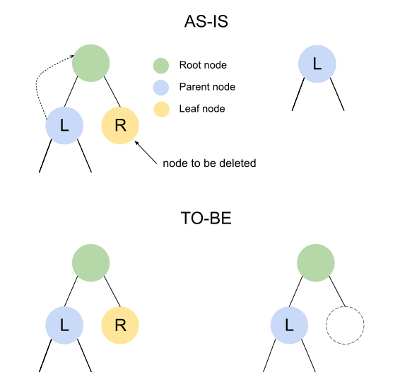

# 2024-03-12 Chain Halt due to ZKTrie Upgrade Post-Mortem

# Incident summary

On March 12, 2024, at 15:16:25 UTC, a fork occurred at block number [8171899](https://kromascan.com/block/8171899).

Some nodes encountered a `BAD BLOCK` error due to a hash discrepancy in that block compared to the block hash of the 
sequencer. This discrepancy was caused by a bug introduced in `KromaZKTrie` in kroma-geth 
[`v0.4.4`](https://github.com/kroma-network/go-ethereum/releases/tag/v0.4.4).

Since the sequencer was using kroma-geth `v0.4.4`, it was recovered by rollback using the chain data of nodes running 
kroma-geth [`v0.4.3`](https://github.com/kroma-network/go-ethereum/releases/tag/v0.4.3).

Block generation was halted for about 7 and a half hours due to this issue, and it took 2 more hours for the chain to be
normalized.

# Background

On Thu, Mar 07, 2024, at 05:00:00 UTC, an upgrade to kroma 
[`v1.3.2`](https://github.com/kroma-network/kroma/releases/tag/v1.3.2) and kroma-geth `v0.4.4` was conducted to enhance 
ZKTrie, which is to store the state of accounts and storage. The upgrade was first tested on the internal devnet and 
Kroma sepolia to validate backward compatibility before being applied to the Kroma mainnet. Nodes with the improved 
ZKTrie were also tested by syncing the canonical chain from the genesis block to approximately 7 million blocks to 
ensure proper functionality. The ZKTrie has also been audited by [Chainlight](https://github.com/kroma-network/go-ethereum/blob/main/docs/audits/2024-02-23_KromaZKTrie_Security_Audit_ChainLight.pdf).

# Causes

There was a bug in the process of deleting nodes in the `KromaZKTrie`. When deleting a node with a depth of 1, the node 
should be removed, leaving an empty node. However, in this case, after deleting the node, another child node was 
mistakenly set as the root node, altering the state tree and resulting in a different state root value.

This issue is first discovered when executing a specific transaction. As a result of execution of the 
[transaction](https://kromascan.com/tx/0x50580775422fee57c8ec78dce4a3598e2246c12d7a73756f874dd117bed0ad72), the 
structure of the tree changed, leading to the calculation of different state roots and thus causing a fork with 
different block hashes.

# Recovery

Nodes running kroma-geth `v0.4.3` had the correct state root. Therefore, the chain was rolled back using the chain data 
of these nodes. All nodes, including the sequencer, were downgraded to kroma `v1.3.1` and kroma-geth `v0.4.3` to 
continue generating correct blocks.

## Timeline (UTC)

- 2024-03-12 0616: fork occurred at 8171899
- 2024-03-12 0619: received alerts from some RPC nodes about discrepancies of latest block
- 2024-03-12 0620: started investigating the fork
- 2024-03-12 0649: announced fork occurrence on discord
- 2024-03-12 0814: requested canonical chain snapshot data from Wemade
- 2024-03-12 0907: announced rollback of Kroma mainnet on discord
- 2024-03-12 0942: set up a new sequencer using the snapshot data provided by Wemade
- 2024-03-12 0949: Chainlight notified
- 2024-03-12 1329: announced that the recovery of Kroma mainnet is on going on discord
- 2024-03-12 1348: restarted a new sequencer
- 2024-03-12 1521: provided rollback snapshot and instructions to security council members
- 2024-03-12 1533: provided rollback snapshot and instructions to etherscan
- 2024-03-12 1548: announced the recovery of Kroma mainnet (RPC, P2P, validator) on discord
- 2024-03-13 0441: found a bug in `KromaZKTrie` and proposed workaround by Chainlight
- 2024-03-13 1212: completed test of rollback for node operators
- 2024-03-13 1239: provided rollback snapshot and instructions on discord
- 2024-03-14 0626: opened PR to fix a bug in `KromaZKTrie`

# How it is fixed

The logic for deleting node with a depth of 1 was modified to ensure proper deletion. This was achieved by removing a 
separate case handling for depth 1 that caused incorrect deletion.

Related PR: https://github.com/kroma-network/go-ethereum/pull/81

# Lessons learned

## No tests for deletion

The absence of tests for node deletion made it impossible to prevent this issue in advance. In the future, more tests 
will be implemented to thoroughly examine the functionality of all functions, thereby preventing such issues in advance.

# Future plan

The bug will be fixed in this [PR](https://github.com/kroma-network/go-ethereum/pull/81), and once merged, it will 
undergo sufficient test on the internal devnet and Kroma sepolia. Additionally, we will re-execute the problematic 
transaction using the `KromaZKTrie` and see if it results in the correct state root. Once all tests are completed, it 
will be applied to the Kroma mainnet, and relevant instructions will be provided via 
[kroma-up](https://github.com/kroma-network/kroma-up).
