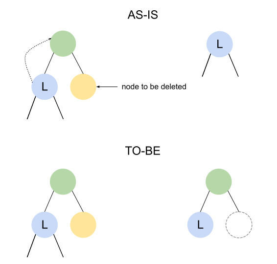

# 2024-03-12 ZKTrie Hardfork Post-Mortem

# Incident Summary

On March 12, 2024, at 15:16:25 UTC, a hardfork occurred at block number 8171899.

Nodes that had not upgraded to kroma [`v1.3.2`](https://github.com/kroma-network/kroma/releases/tag/v1.3.2) and 
kroma-geth [`v0.4.4`](https://github.com/kroma-network/go-ethereum/releases/tag/v0.4.4), which were backward compatible,
encountered a `BAD BLOCK` error at that block. This was due to a bug in `KromaZKTrie` introduced in kroma-geth `v0.4.4`.
The `KromaZKTrie` resulted in a different state root, leading to different block hashes.

This issue was resolved by rolling back the chain data of nodes that had not undergone the upgrade to a snapshot of the 
chain. All nodes, including the sequencer, downgraded to kroma [`v1.3.1`](https://github.com/kroma-network/kroma/releases/tag/v1.3.1)
and kroma-geth [`v0.4.3`](https://github.com/kroma-network/go-ethereum/releases/tag/v0.4.3), allowing for the correct 
blocks to be regenerated.

# Leadup

On Thu, Mar 07, 2024, at 05:00:00 UTC, an upgrade was conducted to enhance ZKTrie, which stores the state of accounts 
and storage. The upgrade was first tested on the internal devnet and Kroma sepolia to validate backward compatibility 
before being applied to the Kroma mainnet. Nodes with the improved ZKTrie were also synced from the genesis block to 
approximately 7 million blocks to ensure proper functionality.

# Causes

There was a bug in the process of deleting nodes in the `KromaZKTrie`. When deleting a node with a depth of 1, the node 
should be removed, leaving an empty node. However, in this case, after deleting the node, another child node was 
mistakenly set as the root node, altering the state tree and resulting in a different state root value.

# Recovery and Lessons Learned

Nodes that had not upgraded to kroma `v1.3.2` and kroma-geth `v0.4.4` retained the correct state root values. Therefore,
the chain was rolled back using the chain data of these nodes. All nodes, including the sequencer, were downgraded to 
kroma `v1.3.1` and kroma-geth `v0.4.3` to continue generating correct blocks.

Significant time was required for the chain to be fully recovered after this incident, resulting in a prolonged halt in 
block generation. This was due to the absence of a rollback strategy during the upgrade process. In future upgrades, a 
rollback strategy will always be provided alongside the upgrade.
