# Output Proposal

<!-- All glossary references in this file. -->

[g-checkpoint-output]: ../glossary.md#checkpoint-output
[g-state]: ../glossary.md#state
[g-validator]: ../glossary.md#validator

<!-- START doctoc generated TOC please keep comment here to allow auto update -->
<!-- DON'T EDIT THIS SECTION, INSTEAD RE-RUN doctoc TO UPDATE -->
**Table of Contents**

- [Overview](#overview)
- [Output Branching Model](#output-branching-model)
- [L2 Output Commitment Construction](#l2-output-commitment-construction)
  - [Output Root Payload (Version 1)](#output-root-payload-version-1)
- [`L2OutputOracle` Interface](#l2outputoracle-interface)
  - [Output Proposal](#output-proposal)
  - [Output Finalization](#output-finalization)
- [Constants](#constants)

<!-- END doctoc generated TOC please keep comment here to allow auto update -->

## Overview

This document addresses one of the limitations of
[the previous output proposal process](../validator.md#submitting-l2-output-commitments) in Fault Proof System V1. When
consecutive invalid [outputs][g-checkpoint-output] are proposed, the previous system's sequential
[challenge](../challenge.md) and deletion mechanism for the first invalid output could lead to insufficient time to
[prove fault](../challenge.md#proving-fault) in subsequent challenges before finalization. Additionally, the limited
participation in each challenge (only designated asserters and challengers) increased the risk of losing challenges due
to timeouts, even for honest parties.

To address these limitations, we introduce **output branching model** which allows the proposal of a new branch of
output when disagreeing with the proposed output. Through the output branching model, it is possible to safely handle
all invalid outputs even in the worst-case where consecutive outputs are invalid.

## Output Branching Model

Outputs are proposed at intervals of L2 blocks defined by `PROPOSAL_INTERVAL`. Each output serves as a
[checkpoint][g-checkpoint-output] for the L2 [state][g-state]. Unlike the previous system where outputs were independent
and restricted to one per index, the output branching model links outputs sequentially.

- **Output Linkage**: The $i^{th}$ output links to the $(i-1)^{th}$ output, allowing multiple _output candidates_ at index
  $i$.
- **Branch Creation**: Each output candidate represents a _branch_. A [validator][g-validator] can propose the $(i+1)^{th}$
  output candidate following the $i^{th}$ output which it agrees with, so multiple branches can emerge at each index.
- **Output Finalization**: A [challenge](./challenge.md) determines which output candidate becomes the finalized $i^{th}$
  output. The winner of the challenge will be the one. All other branches except the branch of the finalized output are
  deemed invalid, as are their subsequent output candidates, such as the $(i+1)^{th}$, $(i+2)^{th}$, ... etc.



## L2 Output Commitment Construction

### Output Root Payload (Version 1)

The version 1 payload is defined as:

```pseudocode
payload = state_root || withdrawal_storage_root || block_hash
```

This version removes the `next_block_hash`, which was added as a means to ensure that the asserter and challenger
executed the same transactions in the target block in the
[previous ZK proof verification process](../challenge.md#proving-fault). The elimination of `next_block_hash` is
feasible now that [transaction data is verifiable on-chain](./transaction-data-commitment.md). This change addresses the
incorrect identification of the first disagreeing block in dissection, as noted in the
[Background](./README.md#background).

## `L2OutputOracle` Interface

### Output Proposal

For the output branching model, there are a few changes to the previous `L2OutputOracle` contract interface as shown
below.

```solidity
/**
 * @notice OutputStatus represents the current status of output.
 *
 * @custom:value NO_OUTPUT No output is proposed.
 * @custom:value PENDING   Output is not finalized yet.
 * @custom:value FINALIZED Output is finalized.
 */
enum OutputStatus {
    NO_OUTPUT,
    PENDING,
    FINALIZED
}

/**
 * @notice CheckpointOutput represents a commitment to the state of L2 checkpoint.
 *
 * @custom:field proposer       Address of the output proposer.
 * @custom:field prevOutputRoot Hash of the previous L2 output directly linked to this output.
 * @custom:field l2BlockNumber  L2 block number that the output corresponds to.
 * @custom:field createdAtBlock L1 block number when this output was created.
 * @custom:field status         Status of the output.
 */
struct CheckpointOutput {
    address proposer;
    bytes32 prevOutputRoot;
    uint128 l2BlockNumber;
    uint64 createdAtBlock;
    OutputStatus status;
}

/**
 * @notice Mapping of output root to checkpoint output.
 */
mapping(bytes32 => CheckpointOutput) internal l2Outputs;

/**
 * @notice Accepts an output root and the corresponding L2 block number. The block number must be
 *         `PROPOSAL_INTERVAL + prevOutputRoot.l2BlockNumber` in order to be accepted. This function may only
 *         be called by the validator.
 *
 * @param prevOutputRoot The previous L2 output root directly linked to output root.
 * @param outputRoot     The L2 output root of the checkpoint block.
 * @param l2BlockNumber  The L2 block number that resulted in output root.
 * @param l1BlockHash    The L1 block hash which must be included in the current chain.
 * @param l1BlockNumber  The L1 block number with the specified L1 block hash.
 */
function proposeL2Output(
    bytes32 prevOutputRoot,
    bytes32 outputRoot,
    uint256 l2BlockNumber,
    bytes32 l1BlockHash,
    uint256 l1BlockNumber
) external payable onlyValidator {
    // 1. Check if prevOutputRoot exists in l2Outputs
    // 2. Ensure that outputRoot does not already exist in l2Outputs
    // 3. Check if (L2 block number of the checkpoint output queried with prevOutputRoot + PROPOSAL_INTERVAL)
    //    is equal to l2BlockNumber
    // 4. Check if the timestamp corresponding to l2BlockNumber is earlier than the current time
    // 5. Ensure that outputRoot is not bytes(0)
    // 6. Verify if the block hash of l1BlockNumber is the same as l1BlockHash (sanity check for reorg)
    // 7. Construct the checkpoint output with outputRoot, including prevOutputRoot information, and store it
    //    in l2Outputs
    // 8. Set the status of the checkpoint output to PENDING
}

/**
 * @notice Get the checkpoint output for the given output root. The output may not exist.
 *
 * @param outputRoot The output root of the checkpoint output to return.
 *
 * @return The checkpoint output struct.
 */
function getL2Output(bytes32 outputRoot) public view returns (CheckpointOutput memory);
```

### Output Finalization

In the output branching model, where multiple outputs at a single index are possible, an additional process to finalize
only one output is required. If a single output is proposed, it can be finalized after `finalizationPeriodBlocks`. In
cases with multiple outputs at an index, a [challenge process](./challenge.md) determines the valid output. Only the
valid output can be finalized. The `finalizationPeriodBlocks` should exceed the
[`challengePeriodBlocks`](./challenge.md#confirm-by-time), the time required before challenge resolution.

```solidity
/**
 * @notice An output can be finalized after finalizationPeriodBlocks has elapsed.
 */
uint64 public finalizationPeriodBlocks;

/**
 * @notice Finalize a pending output.
 *
 * @param outputRoot    The output root of the checkpoint output to finalize.
 * @param winningEdgeId The winning edge id if a challenge is created.
 */
function finalizeOutput(bytes32 outputRoot, bytes32 winningEdgeId) external onlyValidator {
    // 1. Ensure that the output corresponding to outputRoot exists in l2Outputs and is in the PENDING status
    // 2. Check if finalizationPeriodBlocks has elapsed since the proposal of the output
    // 3. Ensure that the previous output connected to the output is the most recently finalized output
    // 4. If there is another output connected to the same previous output, ensure that an edge corresponding
    //    to winningEdgeId exists, is associated with outputRoot, and has the status of CONFIRMED
    // 5. Change the status of the output to FINALIZED
}
```

## Constants

| Name                | Value  | Unit   |
|---------------------|--------|--------|
| `PROPOSAL_INTERVAL` | `1800` | blocks |
